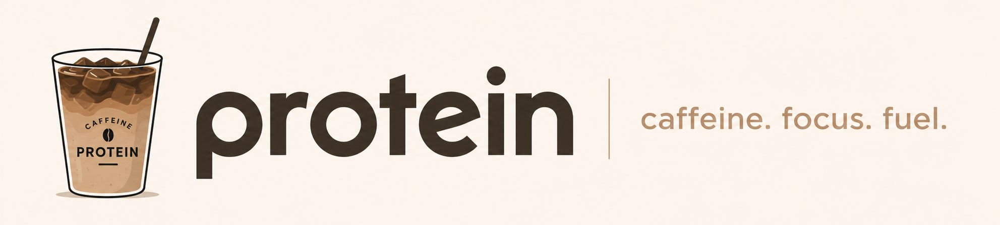
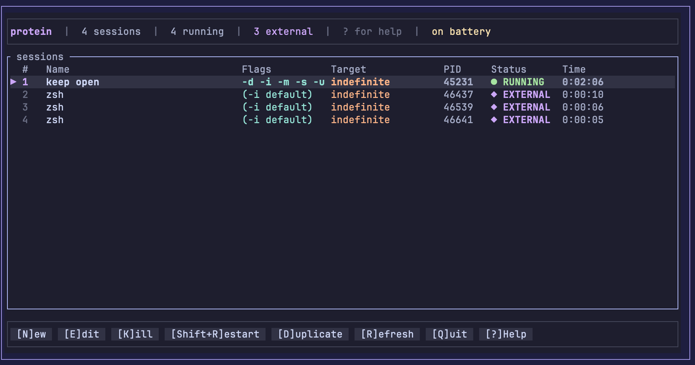
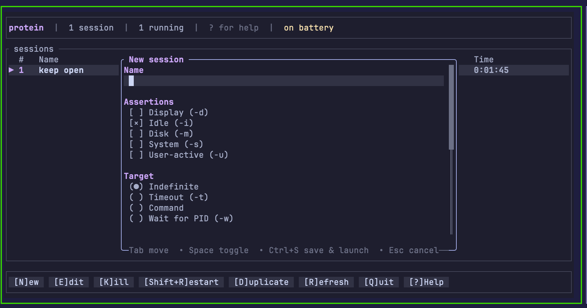
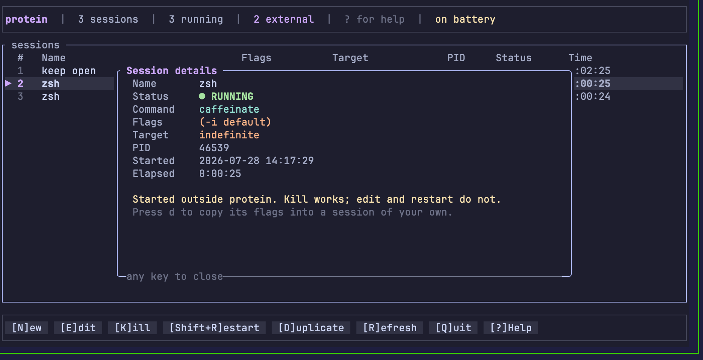
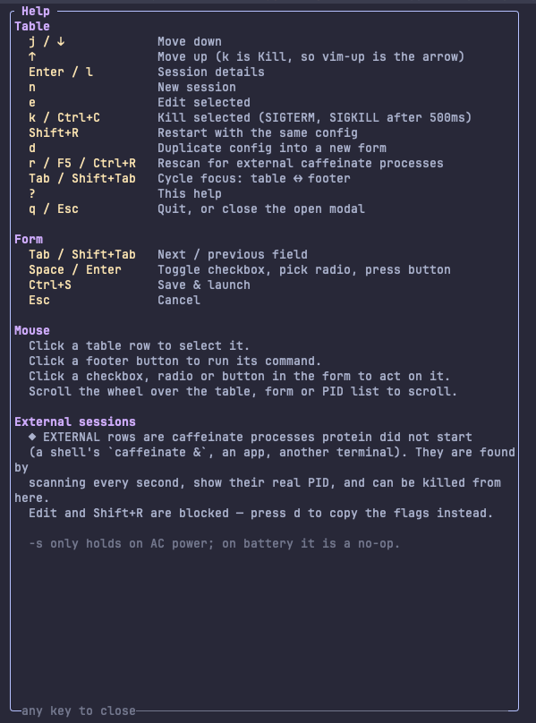

<p align="center">
  
</p>

# Protein

**Protein** is a terminal UI for macOS `caffeinate(8)`. It makes creating and managing sleep assertions a lot easier, without having to remember a bunch of flags.

Create a sleep assertion from a simple form, launch it, watch the countdown, and stop it whenever you want. The binary is called **`caf`**.

`caffeinate` is an awesome tool, but once you start one in the background, it is easy to forget it is even running. Protein gives you a live view of every sleep assertion currently keeping your Mac awake. That includes assertions you started yourself, ones launched from another terminal, and ones created by other applications.

For each assertion you can see the PID, how much time is left, the assertion type, and the exact command that created it, all in one place.

Built with [`ratatui`](https://ratatui.rs) + `crossterm`, Catppuccin Mocha palette.

---

### Session list



```
┌────────────────────────────────────────────────────────────────────────────────────────────────────────────┐
│protein  |  6 sessions  |  3 running  |  3 external  |  ? for help  |  on battery                           │
└────────────────────────────────────────────────────────────────────────────────────────────────────────────┘
┌ sessions ──────────────────────────────────────────────────────────────────────────────────────────────────┐
│  #   Name                         Flags          Target             PID     Status      Time               │
│▶ 1   Movie Mode                   -d -i          2h                 -       ■ STOPPED   -                  │
│  2   Compile Rust                 -i -m          cargo build --rel… -       ■ STOPPED   -                  │
│  3   Old Backup                   -i             indefinite         -       ■ STOPPED   -                  │
│  4   zsh                          (-i default)   indefinite         73979   ◆ EXTERNAL  0:09:29            │
│  5   claude                       -i             5m                 89186   ◆ EXTERNAL  ██░░░░░░░░ 0:04:00 │
│  6   zsh                          -i             15m                91765   ◆ EXTERNAL  ░░░░░░░░░░ 0:14:58 │
└────────────────────────────────────────────────────────────────────────────────────────────────────────────┘
┌────────────────────────────────────────────────────────────────────────────────────────────────────────────┐
│ [N]ew   [E]dit   [K]ill   [Shift+R]estart   [D]uplicate   [R]efresh   [Q]uit   [?]Help                     │
└────────────────────────────────────────────────────────────────────────────────────────────────────────────┘
```

### New / edit form



```
╭ New session ───────────────────────────────────────────────────╮
│Name                                                            │
│ Movie                                                          │
│                                                                │
│Assertions                                                      │
│ [ ] Display (-d)                                               │
│ [×] Idle (-i)                                                  │
│ [ ] Disk (-m)                                                  │
│ [×] System (-s)  no effect on battery                          │
│ [ ] User-active (-u)                                           │
│                                                                │
│Target                                                          │
│ ( ) Indefinite                                                 │
│ (●) Timeout (-t)                                               │
│ ( ) Command                                                    │
│ ( ) Wait for PID (-w)                                          │
│ 7200█                                                          │
│  7200 = 2h                                                     │
│                                                                │
│ [ Save & Launch ]   [ Save Only ]   [ Cancel ]                 │
╰─Tab move  • Space toggle  • Ctrl+S save & launch  • Esc cancel─╯
```

### Session details



```
╭ Session details ─────────────────────────────────────────────────────╮
│  Name       Compile Rust                                             │
│  Status     ■ STOPPED                                                │
│  Command    caffeinate -i -m cargo build --release                   │
│  Flags      -i -m                                                    │
│  Target     cargo build --release                                    │
│  PID        -                                                        │
│  Started    2026-07-28 14:55:51                                      │
│  Elapsed    0:03:03                                                  │
│                                                                      │
│  argv: ["cargo", "build", "--release"]                               │
╰─any key to close─────────────────────────────────────────────────────╯
```

### Help modal



---

## Install

Requires macOS. It shells out to `caffeinate` and `pmset`, and reads the process
table — none of that exists elsewhere.

### Homebrew

Tap this repo, trust it, then install the formula:

```bash
brew tap vianch/protein https://github.com/vianch/protein
brew trust vianch/protein
brew install proteine
proteine
```

The formula ([`Formula/proteine.rb`](Formula/proteine.rb)) builds with `cargo
install` and symlinks the `caf` binary to `proteine`, so both commands work.

### From source

```bash
git clone https://github.com/vianch/protein
cd protein
cargo install --path .
caf
```

Needs stable Rust (built and tested on 1.96).

### Options

```
caf [--ascii] [-h|--help] [-V|--version]
```

| Flag | Effect |
|---|---|
| `--ascii` | Swap box-drawing glyphs for `* + ! - =`, `[x]`, `(*)`, `>` |
| `-h`, `--help` | Usage and exit |
| `-V`, `--version` | Version and exit |

`PROTEIN_ASCII=1` does the same as `--ascii`. Useful over a plain-ASCII terminal,
a serial console, or anywhere the block glyphs render as tofu.

---

## Running manually

You do not have to install it to use it.

```bash
# Debug build, fastest to compile, slowest to run. Fine for a TUI.
cargo run

# Release build — what you actually want day to day.
cargo run --release

# Pass flags through cargo with --
cargo run --release -- --ascii
cargo run --release -- --version

# Or run the built binary directly.
cargo build --release
./target/release/caf
```

The binary is self-contained: no config file is required, and the first launch
with no saved sessions shows an empty list with a prompt to press `n`.

---

## Debugging

A TUI owns the terminal, so `println!` is not available for debugging — anything
printed to stdout lands in the alternate screen and gets overwritten on the next
frame. Use these instead.

### Redirect stderr to a file

`stderr` is not used by the renderer, so it survives. Add `eprintln!` where you
need it and capture it:

```bash
cargo run --release 2>/tmp/caf.log
# in another terminal
tail -f /tmp/caf.log
```

### Backtraces on panic

`ratatui::try_init` installs a panic hook that restores the terminal before the
panic prints, so a crash never leaves you stuck in raw mode with no echo. To see
where it came from:

```bash
RUST_BACKTRACE=1 cargo run --release 2>/tmp/caf.log
```

If a crash ever does leave the terminal wedged, `reset` fixes it.

### Inspect the state file

Everything persisted is plain JSON:

```bash
cat ~/.config/protein/sessions.json | jq
```

A corrupt or hand-mangled file is not fatal — it loads as an empty list rather
than refusing to start, so you can safely poke at it. Delete it to start clean:

```bash
rm ~/.config/protein/sessions.json
```

### Check what the app is seeing

The two things `protein` reads from the system, run by hand:

```bash
pgrep -x caffeinate                # which external sessions should appear
/bin/ps -o pid,ppid,lstart,args -p "$(pgrep -x caffeinate | tr '\n' ',' | sed 's/,$//')"
pmset -g batt                      # drives the "on battery" note and the -s hint
```

If a `caffeinate` shows in `pgrep` but not in the table, press `r` to force a
rescan before filing it as a bug.

### Verify a session really launched

`protein` shows you the command it built; confirm the real process matches:

```bash
# with a session running in the app
/bin/ps -o pid,args -p "$(pgrep -x caffeinate | tr '\n' ',' | sed 's/,$//')"
```

### Drive the TUI non-interactively

The UI is testable without a human because every input path resolves to an
`Action`. For end-to-end checks a pty harness works well — fork a pty, set
`TIOCSWINSZ` to a known size, write keys or SGR mouse sequences (`\x1b[<0;COL;ROWM`
press, `...m` release) to the master fd, and replay the output onto a grid. That is
how every view in this README was captured and how the mouse paths were verified.

### Unit-test the render directly

`ratatui`'s `TestBackend` renders into an in-memory buffer, so layout and the
click map can be asserted without a terminal at all — see the tests at the bottom
of [`src/ui/form.rs`](src/ui/form.rs).

---

## Sessions

A session is one `caffeinate` invocation: a set of assertion flags plus a target
that decides when it ends.

| Flag | Meaning |
|---|---|
| `-d` | Prevent the **display** from sleeping |
| `-i` | Prevent the system from **idle** sleeping |
| `-m` | Prevent the **disk** from idle sleeping |
| `-s` | Prevent the **system** from sleeping — **AC power only** |
| `-u` | Declare the **user** is active |

With no assertion flag selected, `caffeinate` itself defaults to `-i`. The form
says so (`no assertions selected — caffeinate defaults to -i`) rather than
rejecting an empty selection, and the table shows `(-i default)`.

`-s` is a no-op on battery. `protein` reads the power source via `pmset -g batt`,
shows `on battery` in the header and an inline `no effect on battery` note beside
the checkbox — it never blocks the choice. `r` re-reads the power source too, so
unplugging is picked up without a restart.

| Target | Command tail | Ends when |
|---|---|---|
| Indefinite | *(none)* | You kill it |
| Timeout | `-t <secs>` | The timer expires |
| Command | `<utility> <args…>` | The utility exits |
| Wait for PID | `-w <pid>` | That process exits |

Argv is built in real `caffeinate` order — assertions, then `-t`/`-w`, then the
trailing utility. There is no `-p`: it does not exist in the tool.

Timeout sessions get a live progress bar and countdown in the **Time** column
(amber past 90%). Everything else shows elapsed time, switching to `2d 3:04:05`
past a day.

Sessions persist to `~/.config/protein/sessions.json`
(`$XDG_CONFIG_HOME/protein/sessions.json` if set) on exit and reload on start.
Writes are atomic — temp file plus rename — so an interrupted save cannot truncate
the list. Reloaded sessions come back as `STOPPED`: their PIDs died with the
previous run.

> `dirs::config_dir()` is deliberately **not** used. On macOS it resolves to
> `~/Library/Application Support`; this tool's config belongs with your dotfiles.

---

## External sessions

Anything holding a `caffeinate` assertion keeps your Mac awake, whether `protein`
started it or not. So `protein` lists the ones it didn't:

```bash
caffeinate &            # from any shell
caffeinate -i -t 600 &  # or with a timeout
```

Both appear as `◆ EXTERNAL` rows within a second, with their real **PID**, their
flags and target read back out of the live argv, and elapsed time counted from the
process's actual start. The **Name** column shows the *parent* process — `zsh`,
`launchd`, an app name — which is usually the answer to "what started this?".

| | External sessions |
|---|---|
| Discovered | Process-table scan every second, and on demand with `r` |
| Kill (`k`) | **Yes** — SIGTERM, then SIGKILL after 500ms, same as your own |
| Duplicate (`d`) | **Yes** — copies its parsed flags into a new session of yours |
| Edit (`e`) / Restart (`Shift+R`) | **No** — there is no config of yours to edit, and restarting would silently seize someone else's process |
| Persisted | **Never** — rediscovered by scanning, not remembered |
| On quit | **Left alone** — `protein` only kills what it spawned |

The scan reads real argv, so every form `getopt` accepts is understood:

| Observed | Shown as |
|---|---|
| `caffeinate` | `(-i default)`, indefinite |
| `caffeinate -i -t 300` | `-i`, `5m` + progress bar |
| `caffeinate -dimsu` | `-d -i -m -s -u` (bundled flags) |
| `caffeinate -t3600` | `1h` (attached value) |
| `caffeinate -i -w 4242` | `-i`, `wait pid 4242` |
| `caffeinate -i cargo build` | `-i`, `cargo build` |

Your own sessions always sort above external ones, so a machine with six stray
`caffeinate`s doesn't bury them. As rows come and go the selection follows the
**session** rather than the index it happened to sit at.

---

## Keyboard

### Table

| Key | Action |
|---|---|
| `j` / `↓` | Move down |
| `↑` | Move up |
| `Enter` / `l` | Session details |
| `n` | New session |
| `e` | Edit selected |
| `k` or `Ctrl+C` | Kill selected |
| `Shift+R` | Restart with the same config |
| `d` | Duplicate config into a new form |
| `r`, `F5` or `Ctrl+R` | Rescan for external `caffeinate` processes |
| `Tab` / `Shift+Tab` | Cycle focus: table ↔ footer |
| `h` / `l` (footer focused) | Move between footer buttons |
| `?` | Help |
| `q` / `Esc` | Quit, or close the open modal |

Two deliberate consequences of `k` = Kill and `r` = Refresh:

- **There is no vim-up.** `j` still moves down, but `k` kills, so moving up is `↑`.
  A destructive key sitting where vim users reach for "up" is the trade-off; it is
  intentional, not an oversight.
- **Restart is `Shift+R`**, because lowercase `r` refreshes. The footer button
  reads `[Shift+R]estart` so the key is never in doubt.

`x` is unbound. Inside the form `k` types the letter k — the form has its own
keymap and no destructive shortcut.

### Form

| Key | Action |
|---|---|
| `Tab` / `Shift+Tab` / `↓` / `↑` | Next / previous field |
| `Space` | Toggle a checkbox, pick a radio, press a button |
| `Enter` | Same, and advances out of a text field |
| `Ctrl+S` | Save & launch from anywhere in the form |
| `Backspace` | Delete a character |
| `Esc` | Cancel |

- Picking `Timeout`, `Command` or `Wait for PID` drops the caret straight into that
  target's value input.
- Timeout and PID inputs accept digits only.
- Each target keeps its own draft, so switching radios never destroys what you
  typed.
- Focus always scrolls into view. On a short terminal the form is taller than the
  modal; tabbing to `Save & Launch` brings it on screen instead of leaving it
  below the fold.

### PID picker

Reachable from `[ pick from running processes ]` when the target is
**Wait for PID**.

| Key | Action |
|---|---|
| *any character* | Filter by process name or PID prefix |
| `↑` / `↓` | Move |
| `Enter` | Use that PID |
| `Esc` | Back to the form |

---

## Mouse

Mouse capture is on (`EnableMouseCapture`). Every action has both a keyboard and a
mouse route — by construction, not by discipline: clicks resolve to the same
`Action` values the keymap produces.

| Gesture | Effect |
|---|---|
| Click a table row | Select it and focus the table |
| Click a footer button | Exactly what its key does |
| Click a form checkbox | Toggle it |
| Click a form radio | Select it |
| Click a form button | Press it (`Save & Launch`, `Save Only`, `Cancel`) |
| Click `[ pick from running processes ]` | Open the PID picker |
| Click a row in the PID picker | Select that PID and close the picker |
| Scroll wheel over the table | Move the selection |
| Scroll wheel over the form | Scroll the form |
| Scroll wheel over the PID list | Move the selection |

There are no hover states — terminals don't report motion reliably without full
tracking. Focus is shown instead: a lavender border on the focused panel, a filled
background on the focused field or button. Scrollbars appear on the table and the
form only when content overflows.

---

## Validation

Checked on **Save Only** and **Save & Launch**:

- Name is required.
- Timeout must parse and be greater than 0.
- Command must name a utility.

Checked only on **Save & Launch**, because it is about a live process:

- The PID must resolve to a running process (via `sysinfo`).

Failures appear inline above the buttons. Nothing is silently discarded, and
`Save Only` never runs the liveness check — saving a config for a process that
isn't up yet is legitimate.

---

## Process handling

- Sessions are spawned with `tokio::process::Command` and polled once a second
  with `try_wait()`. stdio is `/dev/null`, so a `Command` target's output can't
  scribble over the UI and the child never fights for stdin.
- Kill sends **SIGTERM**, then **SIGKILL** if the process is still alive 500ms
  later. The escalation runs on the poll tick, so the UI never blocks waiting on a
  stubborn child.
- A session that exits on its own becomes `DONE` (or `EXIT <code>`); one you killed
  becomes `STOPPED`. Skips are not laundered into failures.
- Restart kills the old process and waits for it to be reaped before relaunching,
  so a session id never has two live children.
- On quit every child `protein` spawned is terminated and reaped — no orphaned
  `caffeinate`, no zombies. External processes are left running.

---

## Status glyphs

| Glyph | ASCII | Meaning |
|---|---|---|
| ● green | `*` | Running |
| ✓ blue | `+` | Finished on its own |
| ✗ red | `!` | Failed to start |
| ■ grey | `-` | Stopped by you, or loaded from disk |
| ◆ mauve | `=` | External — running, but not started by `protein` |

---

## Architecture

```
protein/
├── Cargo.toml
├── Formula/proteine.rb      # Homebrew formula
├── docs/
│   ├── images/              # logo
│   └── screenshots/         # screenshot placeholders + capture notes
└── src/
    ├── main.rs              # arg parsing, terminal lifecycle, async event loop
    ├── app.rs               # App state, Action enum, handle_action reducer
    ├── models.rs            # CaffeineSession, flags, Target, argv build + parse
    ├── daemon.rs            # spawn / poll / kill / reap
    ├── config.rs            # sessions.json load + atomic save
    ├── utils.rs             # formatting, argv splitting, PID lookup, process scan
    └── ui/
        ├── mod.rs           # frame layout, modal helper, click-region map
        ├── table.rs         # header, session table, footer buttons
        ├── form.rs          # new/edit modal, PID picker (+ render tests)
        ├── help.rs          # help and details modals
        └── styles.rs        # Catppuccin Mocha palette, glyphs
```

### One reducer, two input devices

Every input path — key, click, scroll — resolves to an `Action` and goes through
one function:

```rust
fn handle_action(&mut self, action: Action) -> Option<Action>
```

The returned `Option<Action>` is the follow-up, chained by `dispatch`. The footer
button table is the same data the keymap and the click map read:

```rust
pub const FOOTER_BUTTONS: &[(&str, Action)] = &[
    ("[N]ew", Action::NewSession),
    ("[E]dit", Action::EditSelected),
    ("[K]ill", Action::KillSelected),
    ("[Shift+R]estart", Action::RestartSelected),
    ("[D]uplicate", Action::DuplicateSelected),
    ("[R]efresh", Action::Refresh),
    ("[Q]uit", Action::Quit),
    ("[?]Help", Action::ShowHelp),
];
```

Clicking `[N]ew` and pressing `n` cannot drift apart, because the button *is*
`Action::NewSession`. A test asserts that every footer label's bracketed key
actually dispatches that button's action, so a renamed label can't lie.

Rendering rebuilds a `Vec<(Rect, Action)>` click map each frame; hit-testing walks
it in reverse so modals shadow the table beneath them.

### Data flow

```
                         ┌──── config::load ────┐
                         │  sessions.json       │  (Running → Stopped on load)
                         └──────────┬───────────┘
                                    ▼
  keys / clicks ──► Action ──► handle_action ──► Vec<CaffeineSession> ──► ui::draw
                                    ▲                    ▲                    │
                                    │                    │                    ▼
                       1s Tick ─────┘        reconcile_external      regions: Vec<(Rect, Action)>
                                                       ▲
                                             ProcessScanner::scan
                                            (live caffeinate procs)
```

### Conventions

- **I/O at the edges, logic pure.** `ProcessScanner::scan` is the only thing that
  touches the process table; `App::reconcile_external` takes the resulting list as
  an argument, so it is testable without real processes. Same split for
  `parse_caffeinate_argv`, `split_args`, `format_clock`, `progress_bar`.
- **Ownership is recomputed, never trusted.** `CaffeineSession::external` is
  `#[serde(skip)]` — it is derived from the live process table on every scan, so a
  stale file can never mark a row as someone else's.
- **Errors are actionable.** Kill/spawn failures surface the real message in the
  header rather than a generic string.

---

## Development

```bash
cargo test                                  # 41 unit tests
cargo clippy --all-targets -- -D warnings   # clean
cargo fmt
cargo build --release
```

Tests cover the pure logic and the render:

- **argv both ways** — construction per flag and target, parsing an observed argv
  back into flags and targets (separate, bundled and attached forms), and the round
  trip through both.
- **formatting** — `H:MM:SS`, day rollover, human durations, progress-bar fill,
  ellipsis truncation, quote-aware argv splitting.
- **form** — validation per target, digits-only inputs, tab-order availability,
  wrap-around, the `Save Only` vs `Save & Launch` liveness split.
- **external processes** — adopt, idempotent rescan, drop when the process exits,
  never touching our own rows, never persisting theirs, sort order, and selection
  following the session across reorders.
- **keymap** — the full key→action map including that `x` is unbound, that every
  footer label matches the key it advertises, and that `k` types a letter inside
  the form instead of killing anything.
- **render** — via `ratatui::backend::TestBackend`: a focused control past the fold
  scrolls into view, and the click map covers exactly the controls actually drawn.

### Dependencies

| Crate | Why |
|---|---|
| `ratatui` 0.29 + `crossterm` 0.28 | TUI and terminal backend, mouse capture |
| `tokio` 1 | `process` (spawn/`try_wait`), `time` (tick), `sync` (event channel) |
| `sysinfo` 0.30 | Process table: external scan, PID picker, PID liveness |
| `nix` 0.28 | `SIGTERM` / `SIGKILL` |
| `serde` + `serde_json` | `sessions.json` |
| `chrono` | Timestamps, elapsed and remaining |
| `uuid` | Session ids |
| `dirs` | Home directory for the config path |
| `anyhow` | Error plumbing |

> `ratatui` is 0.29, not the 0.26 the original spec named: 0.26 depends on
> crossterm **0.27**, so pinning crossterm 0.28 next to it links two incompatible
> crossterm versions. 0.29 is the release that pairs with crossterm 0.28.

---

## Platform notes

Things learned the hard way, kept here so they aren't rediscovered:

- **The process scan needs `ProcessRefreshKind::everything()`.** The default
  refresh leaves `cmd()` empty on macOS, which showed every external session as a
  flagless `caffeinate` and silently dropped its `-t`/`-w` target.
- **The PID picker has no CPU column.** macOS does not report another process's CPU
  time to an unprivileged process, so `cpu_usage()` is `0.0` for everything — a
  `0.0%` column sorted "busiest first" would be a lie. Name, memory and a live
  filter do the job.
- **The status poll runs on the UI loop, not a detached task.** The UI is the only
  reader of that state, so a background task would buy an `Arc<Mutex<_>>` and
  identical timing.
- **Multi-day clocks break out days.** A `caffeinate` up for two weeks reads
  `329:46:15` otherwise.

---

## License

MIT — see [`LICENSE`](LICENSE).
